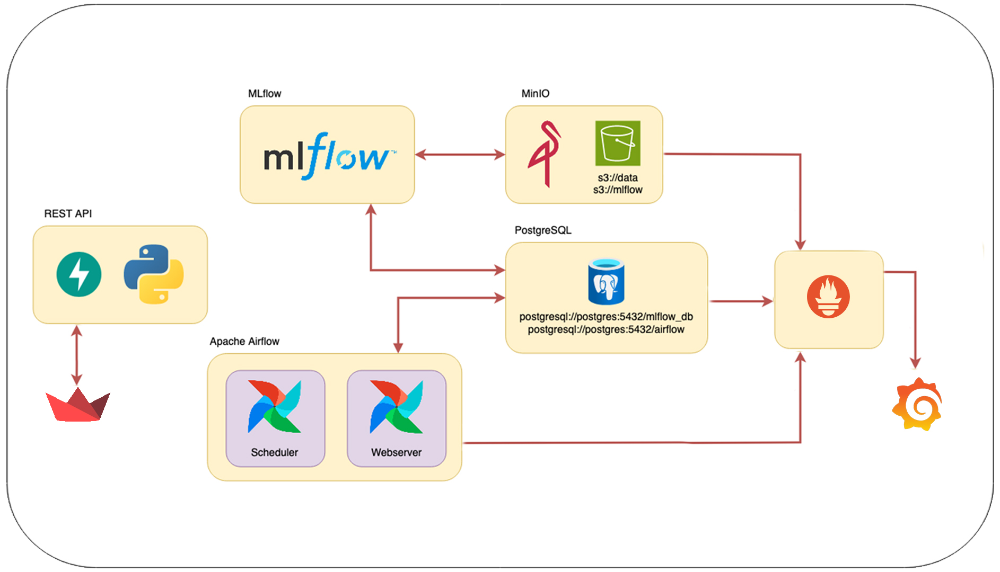

# TP Final AMq2 - CEIA - FIUBA

Integrantes:
- Julio Agustín Donadello
- Diego Braga
- Eduardo Echeverria
- Marco Joel Isidro
- Diego Sarina

## Introducción

En este trabajo práctico integrador de la materia *Aprendizaje de Máquinas II*, hemos llevado a cabo el ciclo completo de MLOps, que incluye desde la preparación y limpieza de datos hasta el despliegue de un modelo de Machine Learning en producción. Este proyecto es una continuación del trabajo realizado en *Aprendizaje de Máquinas I*, donde inicialmente modelamos un sistema de predicción utilizando técnicas de aprendizaje supervisado.

Para este proyecto, utilizamos un dataset sobre el clima en Australia que contiene información recopilada durante 10 años en diversas ciudades del país. Los datos incluyen variables como temperatura, velocidad y dirección del viento, precipitaciones, entre otros.

**Dataset utilizado:** [Kaggle - Rain in Australia](https://www.kaggle.com/datasets/jsphyg/weather-dataset-rattle-package/data)

## Servicios

Los servicios que se implementaron fueron:
- [Apache Airflow](https://airflow.apache.org/)
- [MLflow](https://mlflow.org/)
- API Rest para servir el modelo ([FastAPI](https://fastapi.tiangolo.com/))
- [MinIO](https://min.io/)
- Base de datos relacional [PostgreSQL](https://www.postgresql.org/)
- [Grafana](https://grafana.com/)
- [Prometheus](https://prometheus.io/)
- [Streamlit](https://streamlit.io/)

Por defecto, cuando se inician los multi-contenedores, se crean los siguientes buckets:

- `s3://data`
- `s3://mlflow` (usada por MLflow para guardar los artefactos).

las siguientes bases de datos:

- `mlflow_db` (usada por MLflow).
- `airflow` (usada por Airflow).

y los volumenes para persistir los datos:

- `db_data` (usado por Postgres)
- `minio_data` (usado por MinIO)
- `prometheus_data` (usado por Prometheus)

### Integración de servicios




## Instalación

1. Instalar [Docker](https://docs.docker.com/engine/install/) en tu computadora (o en el servidor que desees usar).

2. Clona este repositorio.

3. Si estás en Linux o MacOS, en el archivo `.env`, reemplaza `AIRFLOW_UID` por el de tu  usuario o alguno que consideres oportuno (para encontrar el UID, usa el comando `id -u <username>`). De lo contrario, Airflow dejará sus carpetas internas como root y no podrás subir DAGs (en `airflow/dags`) o plugins, etc.

4. En la carpeta raíz de este repositorio, ejecutar:

```bash
docker compose --profile all up
```

5. Podrás acceder a los diferentes servicios mediante:
   - Apache Airflow: http://localhost:8080
   - MLflow: http://localhost:5000
   - MinIO: http://localhost:9001 (ventana de administración de Buckets)
   - API: http://localhost:8800/
   - Documentación de la API: http://localhost:8800/docs
   - Grafana: http://localhost:3000/
   - Stremlit: http://localhost:8501/

Recomendamos al usuario ingresar al servicio de [streamlit](http://localhost:8501/) para una experiencia mas agradable. Se adjunta un ejemplo:


## Estructura principal del repositorio

```
.
├── .gitignore
├── .gitattributes
├── LICENSE
├── poetry.lock
├── pyproject.toml
├── diagrama-servicios.png
├── README.md
│
└── servicio-ml
    ├── .env
    ├── docker-compose.yaml
    ├── LICENSE
    │
    ├── airflow
    │   ├── config/
    │   ├── dags/
    │   │   ├── etl_process.py
    │   │   ├── retrain_model.py
    │   ├── plugins/
    │   └── secrets/
    │       ├── connections.yaml
    │       └── variables.yaml
    │
    ├── dockerfiles
    │   ├── airflow/
    │   │   ├── Dockerfile
    │   │   └── requirements.txt
    │   ├── fastapi/
    │   │   ├── app.py
    │   │   ├── Dockerfile
    │   │   └── requirements.txt
    │   ├── grafana/
    │   │   ├── Dockerfile
    │   │   ├── dashboards/
    │   │   │   ├── airflow/
    │   │   │   │   ├── airflow-cluster-dashboard.json
    │   │   │   │   └── airflow-dag-dashboard.json
    │   │   │   ├── minio/
    │   │   │   │   └── minio-dashboard.json
    │   │   │   └── postgres/
    │   │   │   │       └── postgre-dashboard.json
    │   │   ├── provisioning/
    │   │       ├── dashboards/
    │   │       │   └── dashboards.yaml
    │   │       └── datasources/
    │   │           └── datasources.yaml
    │   ├── mlflow/
    │   │   ├── Dockerfile
    │   │   └── requirements.txt
    │   ├── postgres/
    │   │   ├── Dockerfile
    │   │   └── mlflow.sql
    │   ├── prometheus/
    │   │   ├── Dockerfile
    │   │   ├── config/
    │   │       └── prometheus.yml
    │   ├── statsd-exporter/
    │   │   ├── Dockerfile
    │   │   ├── config/
    │   │       └── statsd.yaml
    │   ├── streamlit/
    │       ├── app.py
    │       ├── data_overview.py
    │       ├── Dockerfile
    │       ├── requirements.txt
    │       ├── results.py
    │       ├── test_model.py
    │       ├── components/
    │       │   └── charts.py
    │       └── utils/
    │           ├── data_processing.py
    │           ├── utils.py
    │
    └── notebooks
        ├── mlflow_aux.py
        ├── optuna_aux.py
        ├── plots.py
        ├── train_rain_in_australia.ipynb
```


## Utilización

A continuación se explica como el usuario utilizara el proyecto.

### Airflow

#### DAGs de Airflow para ETL y Reentrenamiento de Modelos

Este repositorio contiene dos DAGs diseñados para ejecutar procesos de ETL y reentrenamiento de modelos en Apache Airflow. Previo a ejecutar el DAG de reentrenamiento, se asume que ya existe un modelo en producción cargado en MLflow. Dicho modelo pudo haber sido generado, por ejemplo, a través del notebook `aprMaq2/servicio-ml/notebooks/train_rain_in_australia.ipynb`.

##### Descripción de los DAGs

###### 1. `etl_process_rain_australia`

- **Script:** `etl_process.py`
- **Descripción:** Este DAG maneja el proceso de carga de datos, incluyendo las transformaciones, la división del dataset en subconjuntos de entrenamiento y validación, y la normalización de los datos de entrada.
- **Programación:** Se ejecuta el primer día de cada mes a las 00:00 horas.

###### 2. `train_model_rain_australia`

- **Script:** `retrain_model.py`
- **Descripción:** Este DAG realiza el reentrenamiento del modelo basado en un modelo existente cargado en MLflow. Si las métricas del nuevo modelo superan a las del modelo existente, el modelo se actualiza, se etiqueta como "champion" y se desmarca el modelo anterior.
- **Programación:** Se ejecuta el primer día de cada mes a las 01:00 horas, una hora después del DAG `etl_process_rain_australia`.

##### Programación de Ejecución

El DAG `etl_process_rain_australia` está programado para ejecutarse a las 00:00 horas del primer día de cada mes. El DAG `train_model_rain_australia` está programado para ejecutarse una hora más tarde, a las 01:00 horas. Según las pruebas realizadas, este intervalo es suficiente para completar el proceso ETL antes de que comience el reentrenamiento.

### MLflow

#### Uso de MLflow en el Proyecto

Este proyecto utiliza [MLflow](https://www.mlflow.org/) para el seguimiento detallado de los procesos de ETL, el tuneo de hiperparámetros y el reentrenamiento de modelos. A continuación, se describen los principales aspectos registrados.

##### Registro de Tuneo de Hiperparámetros

- **Runs y Runs Anidados:** Cada proceso de tuneo de hiperparámetros se registra en MLflow, creando un run principal para el proceso general y runs anidados para cada trial realizado. En cada run anidado, se registran los parámetros específicos utilizados y las métricas obtenidas.
- **Modelos y Artefactos:** Los modelos generados durante el tuneo, junto con sus artefactos, como gráficos de correlación, se almacenan y están disponibles para su revisión.

##### Registro de Procesos del DAG de ETL

- **Datasets Originales y Transformados:** Durante la ejecución del DAG de ETL, se guarda en MLflow información detallada de los datasets originales y transformados. Esto incluye la cantidad de observaciones en los conjuntos de entrenamiento y prueba, así como los parámetros de escalamiento utilizados (media y desviación estándar).

##### Registro de Procesos de Reentrenamiento del Modelo

- **Información de los Runs de Reentrenamiento:** Cada corrida del DAG de reentrenamiento ("challenger") se registra en MLflow, detallando los datos del modelo entrenado, las métricas obtenidas, y si este modelo superó al modelo "champion" en ese momento.
- **Comparación de Métricas:** En caso de que el modelo "challenger" supere al "champion", se registran las métricas de ambos modelos para una comparación detallada, facilitando la toma de decisiones en la promoción de modelos a producción.
...

### Streamlit
En este proyecto, se utilizó Streamlit como la herramienta principal para el desarrollo de la interfaz de usuario. Streamlit es un framework de código abierto que permite la creación rápida de aplicaciones web interactivas y altamente personalizables en Python. La elección de Streamlit se debió a su facilidad de uso, la integración fluida con bibliotecas de ciencia de datos y su capacidad para visualizar datos en tiempo real.

Ventajas de Usar Streamlit:
1. Desarrollo Rápido: Streamlit permite convertir scripts de Python en aplicaciones web interactivas con una mínima cantidad de código adicional. Esto agiliza el proceso de desarrollo, permitiendo a los equipos enfocarse más en la lógica del negocio y en la visualización de los datos.

2. Interactividad y Visualización Dinámica: Con Streamlit, es sencillo agregar controles como sliders, botones, y entradas de texto que permiten a los usuarios interactuar directamente con los datos. Además, la capacidad de actualizar gráficos y tablas en tiempo real mejora significativamente la experiencia del usuario.

3. Integración Sencilla con Bibliotecas de Python: Streamlit se integra perfectamente con bibliotecas populares como Pandas, Matplotlib, Plotly, y TensorFlow, lo que facilita la visualización de datos complejos y modelos de machine learning.

4. Despliegue Sencillo: Las aplicaciones creadas con Streamlit pueden ser desplegadas fácilmente en diferentes entornos, incluyendo servidores locales o servicios en la nube, lo que permite su acceso y uso por parte de diferentes equipos de trabajo o clientes.